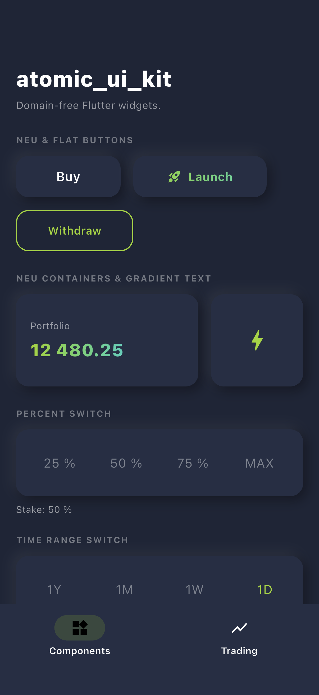

# atomic_ui_kit

A small kit of domain-free Flutter widgets. The kit has neumorphic buttons
and containers, gradient text, a dropdown menu icon, percent and time range
switches, and price badges.

The widgets use only Flutter and `decimal`. They do not know about app
models, state management, or platform plugins.

## Widgets

| Widget | Description |
| --- | --- |
| `NeuButton` | Neumorphic button with an ink splash and an optional gradient. |
| `NeuContainer` | Neumorphic container that paints the neu shadows. |
| `NeuTheme` | `ThemeExtension` with the shared neu shadows, background color, and radius. |
| `AppFlatButton` | Flat button with an ink splash and an optional border. |
| `GradientText` | Paints text with a `Gradient` through a `ShaderMask`. |
| `Indicator` | Colored shape followed by a bold label. |
| `DropdownMenuIcon` | Button that opens an overlay menu and reports the selected item. |
| `AnimatedListItem` | List item that scales and tilts into place on the first build. |
| `PercentSwitch` | Row of 25 %, 50 %, 75 %, and MAX options. |
| `TimeRangeSwitch` | Row of 1Y, 1M, 1W, and 1D options. |
| `PriceBadge` | Price change badge: green for a positive change, red for a negative change. |
| `slideUpRoute` | `Route` that slides a page up from the bottom of the screen. |

## Install

```yaml
dependencies:
  atomic_ui_kit: ^0.1.2
```

## Usage

### NeuButton and NeuTheme

Register `NeuTheme` on the ambient `ThemeData` to restyle every neu widget in
the subtree. Then use `NeuButton`:

```dart
MaterialApp(
  theme: ThemeData(
    extensions: const [
      NeuTheme(
        keyBackgroundColor: Color(0xFF252F45),
        borderRadius: 12,
      ),
    ],
  ),
  home: Center(
    child: NeuButton(
      height: 56,
      width: 200,
      onTap: () {},
      child: const Text('Buy'),
    ),
  ),
);
```

### PercentSwitch

```dart
PercentSwitch(
  onChanged: (percent) {
    // `percent` is 0.25, 0.5, 0.75 or 1.0.
  },
);
```

### TimeRangeSwitch

```dart
TimeRangeSwitch(
  onChanged: (range) {
    // `range` is one of TimeRangeSwitchValue.day, .week, .month or .year.
  },
);
```

### DropdownMenuIcon

```dart
DropdownMenuIcon<String>(
  currentIndex: 0,
  items: const [
    DropdownItem<String>(value: 'one', child: Text('One')),
    DropdownItem<String>(value: 'two', child: Text('Two')),
  ],
  onChange: (value, index) {
    // `value` is the selected DropdownItem value.
  },
  child: const Text('Choose'),
);
```

## Platforms

`atomic_ui_kit` is pure Flutter with no native code and no platform plugins.
It runs on Android, iOS, web, macOS, Windows, and Linux.

## Example

A runnable app in [`example/`](example/) shows the widgets. It has a
components gallery and a trading dashboard.

## Screenshots

<p>
  
</p>
